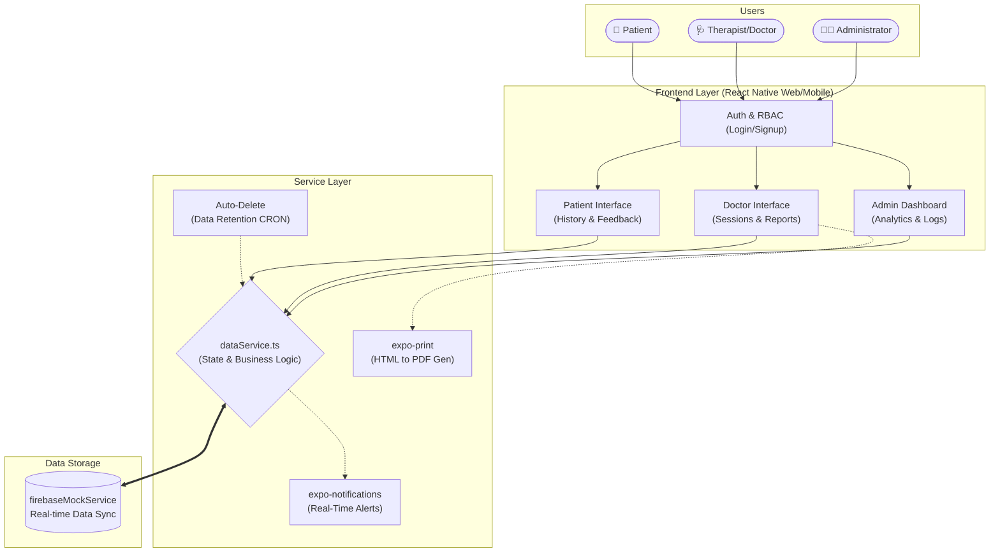

<div align="center">
  
  
  
  <br />
  <h1>🍃 ClarityMind</h1>
  <h3>Enterprise Mental Health & Telehealth Platform</h3>
  <p><i>A beautiful, responsive, and secure healthcare management ecosystem.</i></p>
</div>

---

## ✨ Overview

**ClarityMind** is a state-of-the-art mental health platform designed to bridge the gap between patients seeking peace and certified therapists providing care. Built on a universal React Native architecture, it guarantees a seamless, fluid experience whether accessed via a desktop browser or a mobile device.

<details open>
<summary><b>🔥 Key Capabilities & Modules</b> <i>(Click to collapse)</i></summary>

### 👨‍💼 Administrator Portal
- **Platform Analytics:** Real-time dashboards monitoring total users, active patients, doctors, and platform revenue.
- **Security & Maintenance:** Active CRON job logs validating the automated 30-day data retention purge (HIPAA-ready compliance workflows).
- **Role Management:** Total oversight over all registered users and session histories.

### 🩺 Therapist (Doctor) Portal
- **Session Intelligence:** Deep insights into upcoming appointments and historical patient data.
- **Dynamic PDF Reports:** Built-in `expo-print` engine to compile clinical notes, therapy suggestions, and patient status into native, exportable PDF documents.
- **In-App Notifications:** Real-time push notifications (`expo-notifications`) triggered when accepting or rejecting patient appointment requests.
- **Feedback Loop:** Direct visibility into 5-star patient ratings and written session reviews.

### 🧘 Patient Portal
- **Frictionless Onboarding:** Quick access to book sessions based on specialized therapeutic topics.
- **Session Reviews:** Interactive post-session feedback modules to rate their therapist experience securely.
- **Wallet & Coin System:** Dummy-integrated recharge flow for booking premium telehealth appointments.

</details>

---

## 🎨 Design Philosophy
The application utilizes a custom **Oceanic Design System**. 
> *Constraint-driven design: We strictly avoided dark backgrounds, opting instead for high-contrast slate off-whites, deep navy typography, and vibrant secondary accents to evoke feelings of calm, trust, and professionalism.*

- **Micro-Animations:** Utilizing `react-native-reanimated` (via Expo) for smooth, 60FPS glassmorphic transitions.
- **Responsive Geometry:** Automatically constrains wide web views to a premium `1024px` centered column while remaining 100% full-width fluid on mobile devices.

---

## 🏗 System Architecture



---

## 🔒 Security & Compliance
- **Data Retention Policies:** Automated sweeping of stale sessions older than 30 days to strictly adhere to platform privacy agreements.
- **Role-Based Access Control (RBAC):** Strict navigation barriers preventing unauthorized module access (e.g., Doctors cannot access the global Admin Analytics).

---

## 🚀 Roadmap (Upcoming Enterprise Migration)
- [ ] Migrate `dataService.ts` state to **Firebase Firestore**.
- [ ] Integrate **Stripe API** for live patient wallet top-ups.
- [ ] Deploy **WebRTC** for in-app secure video consultations.
- [ ] Implement **Multi-Factor Authentication (MFA)** for all Administrator accounts.

> Edited for use in IDX on 07/09/12

# Welcome to your Expo app 👋

This is an [Expo](https://expo.dev) project created with [`create-expo-app`](https://www.npmjs.com/package/create-expo-app).

## Get started

#### Android

Android previews are defined as a `workspace.onStart` hook and started as a vscode task when the workspace is opened/started.

Note, if you can't find the task, either:
- Rebuild the environment (using command palette: `IDX: Rebuild Environment`), or
- Run `npm run android -- --tunnel` command manually run android and see the output in your terminal. The device should pick up this new command and switch to start displaying the output from it.

In the output of this command/task, you'll find options to open the app in a

- [development build](https://docs.expo.dev/develop/development-builds/introduction/)
- [Android emulator](https://docs.expo.dev/workflow/android-studio-emulator/)
- [Expo Go](https://expo.dev/go), a limited sandbox for trying out app development with Expo

You'll also find options to open the app's developer menu, reload the app, and more.

#### Web

Web previews will be started and managred automatically. Use the toolbar to manually refresh.

You can start developing by editing the files inside the **app** directory. This project uses [file-based routing](https://docs.expo.dev/router/introduction).

## Get a fresh project

When you're ready, run:

```bash
npm run reset-project
```

This command will move the starter code to the **app-example** directory and create a blank **app** directory where you can start developing.

## Learn more

To learn more about developing your project with Expo, look at the following resources:

- [Expo documentation](https://docs.expo.dev/): Learn fundamentals, or go into advanced topics with our [guides](https://docs.expo.dev/guides).
- [Learn Expo tutorial](https://docs.expo.dev/tutorial/introduction/): Follow a step-by-step tutorial where you'll create a project that runs on Android, iOS, and the web.

## Join the community

Join our community of developers creating universal apps.

- [Expo on GitHub](https://github.com/expo/expo): View our open source platform and contribute.
- [Discord community](https://chat.expo.dev): Chat with Expo users and ask questions.
